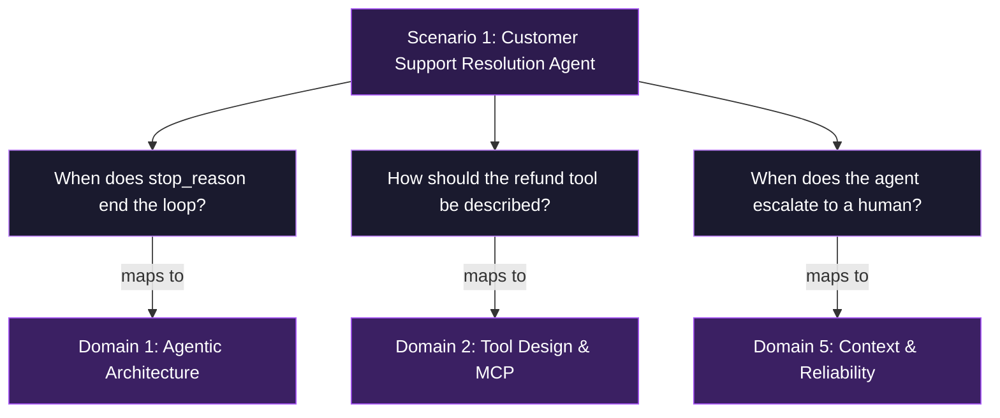
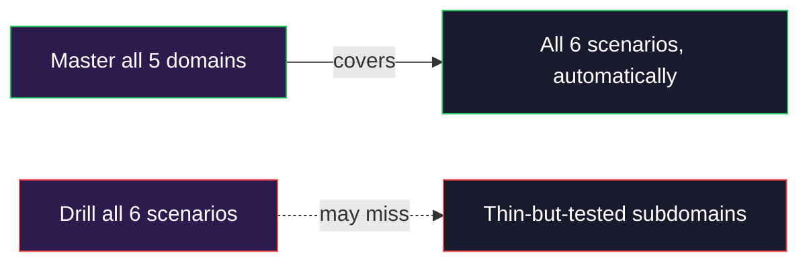

# The Two-Axis Model: Domains and Scenarios

The CCA-F exam organizes its coverage along two axes. Understanding how they relate is the difference between complete preparation and accidental gaps. This guide explains both axes, shows how they connect, and identifies which one should drive a study plan.

## The Core Idea

- **Axis 1: Domains** are the *what*. Five weighted knowledge areas that define everything testable.
- **Axis 2: Scenarios** are the *wrapper*. Six production contexts that questions arrive dressed in.
- The two axes are **dependent**: scenarios are delivery vehicles for domain questions, not a separate body of content.
- One axis is **primary** (domains) and one is **presentational** (scenarios).

```mermaid
flowchart LR
    subgraph AXIS1["Axis 1: Domains (what is tested)"]
        D1["D1 Agentic Architecture 27%"]
        D2["D2 Tool Design & MCP 18%"]
        D3["D3 Claude Code 20%"]
        D4["D4 Prompt Eng & Structured Output 20%"]
        D5["D5 Context & Reliability 15%"]
    end
    subgraph AXIS2["Axis 2: Scenarios (wrapper questions arrive in)"]
        S["6 production scenarios, 4 shown per attempt"]
    end
    AXIS2 -->|draws questions from| AXIS1
    style AXIS1 fill:#1a1a2e,stroke:#a855f7,color:#fff
    style AXIS2 fill:#1a1a2e,stroke:#a855f7,color:#fff
    style D1 fill:#2d1b4e,stroke:#a855f7,color:#fff
    style D2 fill:#2d1b4e,stroke:#a855f7,color:#fff
    style D3 fill:#2d1b4e,stroke:#a855f7,color:#fff
    style D4 fill:#2d1b4e,stroke:#a855f7,color:#fff
    style D5 fill:#2d1b4e,stroke:#a855f7,color:#fff
    style S fill:#2d1b4e,stroke:#a855f7,color:#fff
```

## Axis 1: Domains

The five domains carry fixed weights that sum to 100%. Weight reflects how heavily each area is sampled.

| Domain | Title | Weight |
|--------|-------|--------|
| 1 | Agentic Architecture & Orchestration | 27% |
| 2 | Tool Design & MCP Integration | 18% |
| 3 | Claude Code Configuration & Workflows | 20% |
| 4 | Prompt Engineering & Structured Output | 20% |
| 5 | Context Management & Reliability | 15% |

Key points:

- Weights are the real budget. Domain 1 alone is more than a quarter of the score.
- Every testable fact lives in a domain. Nothing is testable that does not map to one of these five.
- Mastering all five domains covers the entire exam by definition.

## Axis 2: Scenarios

Six production scenarios exist. Each attempt presents four of them at random. Each scenario maps to a subset of domains.

| # | Scenario | Domains Tested |
|---|----------|----------------|
| 1 | Customer Support Resolution Agent | 1, 2, 5 |
| 2 | Code Generation with Claude Code | 3, 5 |
| 3 | Multi-Agent Research System | 1, 2, 5 |
| 4 | Developer Productivity with Claude | 1, 2, 3 |
| 5 | Claude Code for Continuous Integration | 3, 4 |
| 6 | Structured Data Extraction | 4, 5 |

Key points:

- A scenario adds no new testable material. It only supplies context (a system, a scale, a success metric) around domain questions.
- The random selection of four scenarios per attempt means coverage of any single scenario is not guaranteed, but coverage of the domains underneath them is.

## How the Axes Connect

Every scenario decomposes into domain questions. The scenario is the story; the domains are the substance.

### Worked Example

The same domain concept appears across different scenarios, just re-skinned:

| Domain Concept (D1, agentic loop) | Scenario 1 Skin | Scenario 3 Skin |
|-----------------------------------|-----------------|-----------------|
| Loop terminates on `stop_reason == "end_turn"` | Support agent finishes resolving a billing dispute | Research coordinator finishes aggregating subagent findings |
| Loop continues on `stop_reason == "tool_use"` | Agent calls `lookup_order` then reasons again | Coordinator calls a subagent then reasons again |

The tested fact is identical. Only the wrapper changes. This is why the scenario is presentational and the domain is primary.

## Why Domains Are the Primary Axis

The relationship between the axes is asymmetric. That asymmetry decides where study effort belongs.

- **Domains up, scenarios covered.** Full domain mastery guarantees every scenario is handled, because scenarios contain nothing outside the domains.
- **Scenarios up, domains not guaranteed.** Drilling scenarios alone can leave gaps, because a scenario may exercise only part of a domain. A subdomain that no listed scenario emphasizes can still be tested.
- **Weight follows domains, not scenarios.** Scoring samples by domain weight. There is no per-scenario weight to optimize against.

## Practical Takeaway

- **Anchor the study plan on domains.** Use the five weights as the coverage map. Confirm every subdomain is covered before considering the plan complete.
- **Use scenarios as practice contexts, not as a checklist.** They are excellent for rehearsing applied judgment, but they are not a substitute for systematic domain coverage.
- **Watch for the trap.** Treating scenarios as an independent content axis leads to over-studying the wrappers and under-covering thin subdomains that still carry points.

## Summary

- Two axes: domains (what is tested) and scenarios (the wrapper).
- They are dependent: scenarios draw their questions entirely from domains.
- Domains are primary and weighted; scenarios are presentational and unweighted.
- Plan by domain for guaranteed coverage; drill by scenario for applied rehearsal.